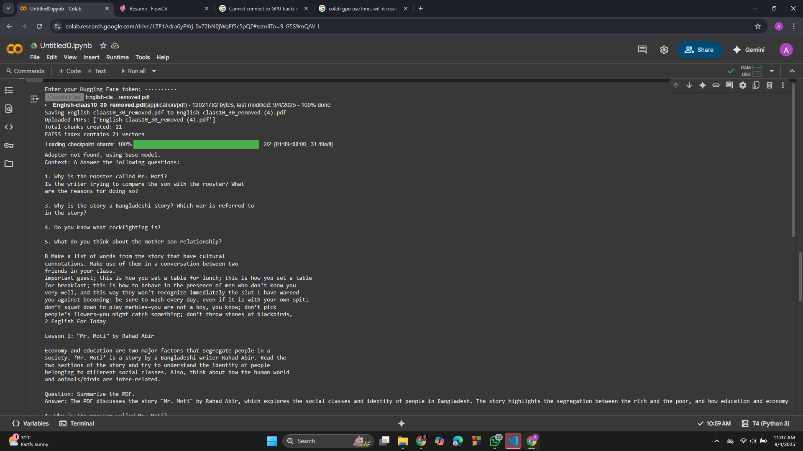
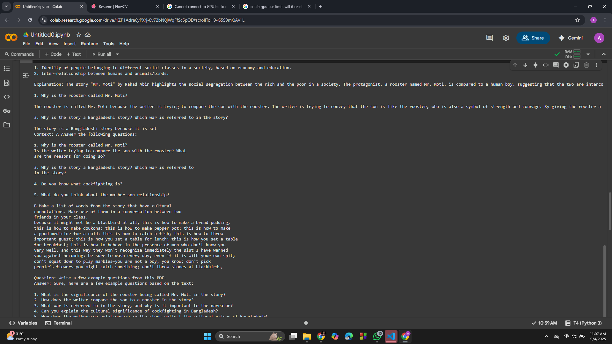
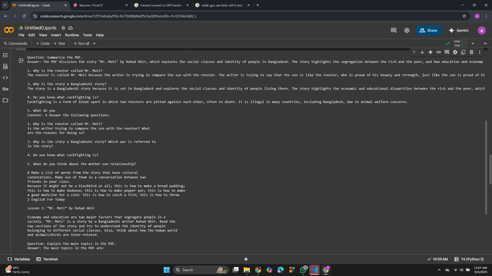

# RAG-based PDF QA System

A **Retrieval-Augmented Generation (RAG)** system to answer questions from PDF documents using **LLaMA-2 4-bit** models, embeddings, and vector search.

---

## Features

- Extract text from PDFs using **OCR** (`PyPDF2`, `pytesseract`, `pdf2image`)  
- Chunk text for efficient retrieval using **LangChain**  
- Create embeddings with **Sentence-Transformers** and search with **FAISS**  
- Answer queries with a **4-bit LLaMA-2 model** and optional LoRA adapters  
- Supports multi-page PDFs and complex queries  

---

## Screenshots

**1. Upload PDFs and text extraction:**  
  

**2. Question & Ans:**  
  

**3. Question and Ans part 2**  
  

---

